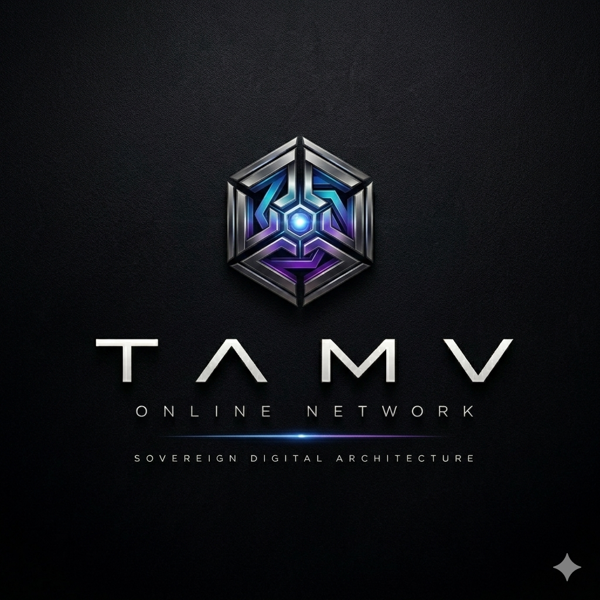
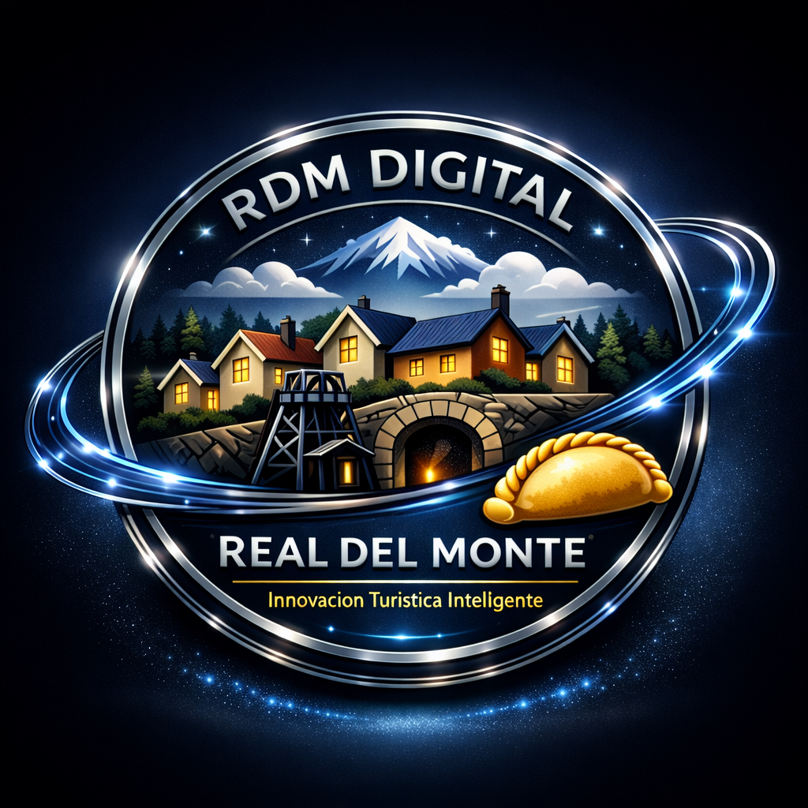

<p align="center">
  <a href="https://github.com/OsoPanda1/rdm-digital-hub-ldtocs">
    
  </a>
</p>

<p align="center">
  <a href="https://orcid.org/0009-0008-5050-1539"></a>
  <a href="https://doi.org/10.5281/zenodo.20606361"></a>
  <a href="https://replit.com/"></a>
  <a href="./LICENSE-PRCL.md"></a>
</p>

<table align="center" cellpadding="10">
  <tr>
    <td align="center" width="33%">
      <br/>
      <strong>TAMV Online Network</strong><br/>
      <small>Marca del ecosistema</small>
    </td>
    <td align="center" width="33%">
      <br/>
      <strong>RDM Digital Hub</strong><br/>
      <small>Nodo cero MD-X4</small>
    </td>
    <td align="center" width="33%">
      <br/>
      <strong>Isabella AI</strong><br/>
      <small>Motor IA Conversacional</small>
    </td>
  </tr>
</table>

---

<h1 align="center">RDM Digital Hub — LDTOCS</h1>

<p align="center">
  <em>"La tecnología es el puente entre el patrimonio y el futuro."</em><br/>
  <strong>Anubis Villaseñor — Urban Legent</strong>
</p>

<p align="center">
  <a href="https://nodejs.org/"></a>
  <a href="https://react.dev/"></a>
  <a href="https://www.typescriptlang.org/"></a>
  <a href="https://vitejs.dev/"></a>
  <a href="https://supabase.com/"></a>
</p>
<p align="center">
  <a href="https://github.com/OsoPanda1/rdm-digital-hub-ldtocs/actions"></a>
  <a href="./LICENSE-PRCL.md"></a>
  <a href="./LICENSE"></a>
</p>

---

Plataforma de **Soberanía Digital**, **Turismo Inteligente** e **Infraestructura Federada** para comunidades, implementada como nodo replicable **TAMV MD-X4** en Real del Monte, Hidalgo, México.

---

## Indice

| Seccion | Descripcion |
|---------|-------------|
| [Vision y Problematica](#vision-y-problematica-territorial) | El desafio social y tecnico que resuelve |
| [Arquitectura del Hub](#definicion-del-hub-nodo-cero-md-x4) | Que es el RDM Digital Hub |
| [7 Federaciones TAMV](#modelo-de-gobernanza-las-7-federaciones-del-tamv) | Modelo de gobernanza federada |
| [Monorepo y Estructura](#arquitectura-de-software-y-monorepo) | Estructura del repositorio |
| [Stack Tecnologico](#stack-tecnologico-unificado) | Tecnologias y justificacion |
| [Matriz de Madurez](#modulos-y-matriz-de-madurez) | 22 modulos auditados con % real |
| [Gamificacion y Living World](#gamificacion-phygital-territorial) | Sistema de juego territorial |
| [Banners Distribuidos](#sistema-de-banners--publicidad-distribuida) | 80 banners en toda la plataforma |
| [Isabella AI Engine](#isabella-ai-engine--omega-core-v40-enterprise) | IA conversacional con arquitectura completa |
| [Radio TAMV 92.5 FM](#tamv-925-fm-radio--azuracast) | Radio automatizada en la nube |
| [Despliegue](#despliegue-e-infraestructura-soberana) | Replit Autoscale + Variables de entorno |
| [Respaldo Academico](#respaldo-academico-y-ciencia-abierta) | CITIS 2026, ORCID, Zenodo |
| [Licenciamiento](#regimen-de-licenciamiento) | Licencias multicapa |

---

## Vision y Problematica Territorial

### El Desafio Social

Comunidades locales y pueblos magicos operan bajo **cero soberanía digital**, expuestos a la intermediacion extractiva de plataformas monopolisticas:

- **Extractivismo Economico:** perdida sistematica de capital local sin retorno a la comunidad.
- **Fragil Institucional:** vulnerabilidad ante cambios unilaterales en algoritmos y politicas de datos.
- **Fragmentacion:** turismo, comercio, cultura y civismo dispersos en apps desconectadas.
- **Erosion Identitaria:** interfaces genericas que ignoran patrimonio historico intangible.

### El Desafio Tecnico

1. **Dependencia de conectividad:** inoperatividad en zonas de montaña.
2. **Sin gobernanza algoritmica:** ausencia de IA etica con contexto cultural.
3. **Puntos unicos de fallo:** arquitecturas centralizadas susceptibles a caidas.

---

## Definicion del Hub (Nodo Cero MD-X4)

**RDM Digital Hub** es la primera infraestructura **digital soberana, federada y antifragil** disenada desde el territorio:

- **Turismo Inteligente:** cartografia vectorial en tiempo real, clusterizacion de POIs, geofencing cultural.
- **Radio Difusora TAMV 92.5 FM:** streaming integrado al flujo web/movil.
- **Comercio Soberano:** conexion directa P2P sin comision extractiva.
- **IA Colectiva (Isabella AI):** asistente conversacional con pipelines eticos y arquitectura modular de skills.
- **Gemelos Digitales:** fusion de capas geoespaciales y datos territoriales.

---

## Modelo de Gobernanza: Las 7 Federaciones del TAMV

Articuladas por el bus de datos **YUN**:

```text
                  ┌─────────────────────────────────────────┐
                  │          BUS DE EVENTOS YUN             │
                  └────────────────────┬────────────────────┘
                                       │
     ┌──────────┬──────────┬───────────┼───────────┬──────────┬──────────┐
     ▼          ▼          ▼           ▼           ▼          ▼          ▼
 ┌───────┐  ┌───────┐  ┌───────┐   ┌───────┐   ┌───────┐  ┌───────┐  ┌───────┐
 │  F1   │  │  F2   │  │  F3   │   │  F4   │   │  F5   │  │  F6   │  │  F7   │
 │Identid│  │Memoria│  │Turismo│   │Economí│   │Gemelos│  │  IA   │  │  PQC  │
 └───────┘  └───────┘  └───────┘   └───────┘   └───────┘  └───────┘  └───────┘
```

| Federacion | Nombre | Funcion |
|-----------|--------|---------|
| **F1** | Identidad Soberana | Autenticacion descentralizada, PKCE, reputacion civica |
| **F2** | Patrimonio y Memoria | Archivos inmutables, tradicion oral, enciclopedia territorial |
| **F3** | Turismo Inteligente | Rutas dinamicas, geofencing, mapas de calor |
| **F4** | Economia Local | Directorio comercial, intercambio justo, lealtad territorial |
| **F5** | Gemelos Digitales | Representacion 3D, monitoreo ambiental, mapas offline-first |
| **F6** | IA Colectiva | Isabella AI, orquestacion de agentes (Orion, Sophia, Argus, Mnemos, Lumen) |
| **F7** | Resiliencia PQC | Criptografia post-cuantica, BookPI Ledger, tolerancia a fallos |

---

## Arquitectura de Software y Monorepo

```text
rdm-digital-hub-ldtocs/
├── artifacts/
│   ├── api-server/               # Backend Express 5 — API Gateway (Node.js 20)
│   │   └── src/
│   │       ├── routes/           # 7 archivos de rutas (7+ endpoints)
│   │       ├── lib/isabella/     # Isabella Ω-Core v4.0 Enterprise (12 modulos)
│   │       ├── lib/ai/           # Capa AI: ISA API, Mexa API, Knowledge (3 archivos)
│   │       ├── db/schema.ts      # Schema Drizzle ORM (Supabase PostgreSQL)
│   │       └── config/           # Liquidsoap, radio config
│   └── rdm-hub/                  # Frontend SPA (React 19 + Vite 7 + Tailwind)
│       └── src/
│           ├── pages/            # 111 paginas
│           ├── components/       # 112 componentes (shadcn/ui + Leaflet + Three.js)
│           ├── modules/          # 13 modulos especializados
│           ├── hooks/            # Custom React hooks
│           ├── stores/           # Zustand stores
│           └── assets/           # 100+ imagenes, audio, video
├── lib/                          # Librerias compartidas del workspace
│   ├── db/                       # Schema Drizzle ORM compartido
│   ├── api-zod/                  # Validacion Zod para API
│   ├── api-spec/                 # OpenAPI spec + Orval codegen
│   └── api-client-react/         # Clientes API tipados (React hooks)
├── docs/                         # Documentacion tecnica
│   ├── adr/                      # Architecture Decision Records (3 ADRs)
│   └── radio/                    # Guia de deployment AzuraCast
├── .agents/memory/               # Memoria de agentes IA
├── pnpm-workspace.yaml           # Workspaces con catalog protocol
└── package.json                  # Root workspace
```

### Numeros Clave

| Metrica | Valor |
|---------|-------|
| Paginas frontend | 111 |
| Componentes UI | 112 |
| Modulos especializados | 13 |
| API route files | 7 |
| Isabella Ω-Core modules | 12 |
| Workspace libs | 4 |
| ADRs documentados | 3 |
| Assets multimedia | 100+ |

---

## Stack Tecnologico Unificado

| Capa | Tecnologia | Funcion |
|------|-----------|---------|
| **Frontend** | React 19 + TypeScript 5.9 | Renderizado reactivo con tipado estricto |
| **Build** | Vite 7.3.6 | Compilacion incremental, HMR |
| **Estilos** | Tailwind CSS + shadcn/ui | Diseno accesible, responsivo |
| **Routing** | React Router v7 | Lazy loading, navegacion SPA |
| **Estado** | Zustand | State management liviano |
| **Mapas** | Leaflet + Supercluster | Capas vectoriales, clusterizacion de POIs |
| **3D** | Three.js + React Three Fiber | Gemelos digitales, visualizaciones |
| **Animaciones** | Framer Motion | Transiciones y micro-interacciones |
| **Backend** | Express 5 + Node.js 20 | API Gateway asincrona |
| **DB** | Supabase (PostgreSQL) | Persistencia relacional con RLS |
| **ORM** | Drizzle ORM | Type-safe queries, migrations |
| **Validacion** | Zod | Schema validation end-to-end |
| **API Spec** | OpenAPI + Orval | Codegen de clientes tipados |
| **Radio** | AzuraCast + Liquidsoap | AutoDJ, streaming, programacion 24/7 |
| **Despliegue** | Replit Autoscale | Contenedores auto-escalables |

---

## Modulos y Matriz de Madurez

Auditoria real del codebase — porcentajes basados en codigo funcional vs. stubs/placeholders.

| # | Modulo | % | Estado | Archivos Clave |
|---|--------|---|--------|---------------|
| 1 | **Portal Turistico** | `78%` | 🟡 | `Index.tsx`, `Lugares.tsx`, `QuienesSomos.tsx` |
| 2 | **Motor Mapas** | `82%` | 🟢 | `Mapa.tsx`, `UnifiedMap.tsx`, `TerritorialSVGMap.tsx` |
| 3 | **Auth / Identidad** | `75%` | 🟡 | `RDMAuthContext.tsx`, `rbac.ts` |
| 4 | **TAMV 92.5 Radio** | `88%` | 🟢 | `ArchivoSonoro.tsx`, `RadioPlayer.tsx`, `routes/radio.ts` |
| 5 | **Musica Territorial** | `72%` | 🟡 | `Musica.tsx`, `SpatialPlayer.tsx` |
| 6 | **Gamificacion Phygital** | `60%` | 🟠 | `GamificationHUD.tsx`, `engine.ts`, `routes/gamification.ts` |
| 7 | **RDM Living World** | `58%` | 🟠 | `schema.ts`, `narrator.ts`, SQL triggers, ADR-001/003 |
| 8 | **Banners Comerciales** | `88%` | 🟢 | `banners-data.ts` (80), `BannerManager.tsx` |
| 9 | **Panel Admin** | `55%` | 🟠 | `Dashboard.tsx` — CRUD negocios funcional |
| 10 | **Isabella AI Engine** | `75%` | 🟡 | `routes/isabella.ts` (18 endpoints), `isabella/` (12 modulos) |
| 11 | **Bus de Federacion YUN** | `28%` | 🔴 | `federation.ts` — conceptual |
| 12 | **Seguridad PQC** | `32%` | 🔴 | `PostQuantumCrypto.ts` — conceptual |
| 13 | **Directorio Comercios** | `80%` | 🟢 | `Comercios.tsx`, `BusinessCard.tsx` — Supabase live |
| 14 | **Transporte Local** | `55%` | 🟠 | `TransporteLocal.tsx` — datos cargan |
| 15 | **Wiki / Enciclopedia** | `65%` | 🟠 | `Wiki.tsx` — lectura Supabase |
| 16 | **Rutas Turisticas** | `82%` | 🟢 | `Rutas.tsx` — 6 rutas completas |
| 17 | **Ecoturismo** | `78%` | 🟡 | `Ecoturismo.tsx` — 6 actividades |
| 18 | **Donaciones** | `60%` | 🟠 | `Donar.tsx` — Stripe checkout funcional |
| 19 | **Realito AI Chat** | `68%` | 🟡 | `RealitoBubble.tsx` — chat UI + SSE |
| 20 | **Telemetria** | `45%` | 🟠 | `sentry.ts`, `TelemetryDashboard.tsx` |
| 21 | **Search / UX** | `55%` | 🟠 | `SearchOverlay.tsx` — client-side |
| 22 | **Digital Twins** | `48%` | 🟠 | `Map3DTwin.tsx` — conceptual |

### Leyenda

| Estado | Significado |
|--------|-------------|
| 🟢 80-100% | Produccion viable — pulido menor pendiente |
| 🟡 60-79% | Funcional — gaps notables en logica/persistencia |
| 🟠 40-59% | Parcial — UI funcional, datos mock o sin backend |
| 🔴 0-39% | Conceptual — arquitectura disenada, sin implementacion |

---

## Checklist de Funcionalidades Pendientes

### Produccion Cercana (pulido menor)

- [ ] **Radio:** playback de episodios, podcast archive, listener count en frontend
- [ ] **Banners:** admin CRUD, click tracking, A/B testing
- [ ] **Mapas:** markers desde DB, heatmap layer, offline-first caching
- [ ] **Rutas:** booking funcional, "Descargar Mapa" real, reviews
- [ ] **Comercios:** detail page, reviews, photo galleries

### Funcional pero Incompleto

- [ ] **Portal:** image CDN, booking flow, SEO coverage, i18n
- [ ] **Auth:** RBAC middleware, profile management, OAuth, 2FA
- [ ] **Musica:** recommendation engine con datos reales, listening history
- [ ] **Isabella:** backend persistence (no in-memory), RAG pipeline real
- [ ] **Ecoturismo:** weather integration, trail calculator, user reviews
- [ ] **Donaciones:** donation history, tax receipts, recurring donations

### Requieren Trabajo Significativo

- [ ] **Gamificacion:** quest completion real, QR check-in, seasonal resets
- [ ] **Living World:** schema en produccion, world event scheduling, season rotation
- [ ] **Panel Admin:** analytics con datos reales, user management, audit log
- [ ] **Transporte:** real-time tracking, booking, schedules
- [ ] **Wiki:** article authoring, search, version history
- [ ] **Telemetry:** structured logging, Web Vitals, alerting
- [ ] **Search:** server-side search, fuzzy matching, autocomplete

### Conceptual (sin implementacion)

- [ ] **Federacion YUN:** P2P sync real, cross-node communication
- [ ] **Seguridad PQC:** Kyber/Dilithium reales, hardware key integration
- [ ] **Digital Twins:** IoT sensor integration, BIM loading, 3D rendering

---

## Gamificacion Phygital Territorial

Sistema de **juego territorial phygital** que transforma la experiencia turistica en aventura interactiva:

### Bucle de Juego

```
Descubrir POI → Interactuar (QR/Sensor) → Validacion Criptografica → Recompensa (XP/Points) → Subir Nivel
```

### Rangos de Prestigio

1. **Explorador** — Rango base
2. **Cronista** — Rango intermedio
3. **Minero Legendario** — Rango avanzado
4. **Guardian del Pueblo** — Estatus maximo territorial

### Recompensas

- **RDM Points** canjeables en comercios participantes
- **Temporadas trimestrales (90 dias)** con leaderboards y premiacion en festivales

---

## RDM Living World — Arquitectura de Juego

Sistema evolutivo con gamificacion, narrativa inteligente, economia interna y coleccion de patrimonio.

### Decisiones de Arquitectura

| ADR | Estado | Contenido |
|-----|--------|-----------|
| ADR-001 | ACEPTADO | Esquema de datos, roadmap 6 fases |
| ADR-003 | ACEPTADO | Economia 8 monedas, prestigio territorial |
| ADR-004 | ACEPTADO | Isabella Omega Core v4.0 Enterprise |

### Base de Datos (Drizzle ORM + Supabase)

Schema en `artifacts/api-server/src/db/schema.ts`:

- **players** / **player_avatars** — Identidad y avatar
- **territories** / **poi_state** — POIs y eventos
- **seasons** / **world_state_snapshots** — Temporadas
- **player_currencies** — 8 tipos de moneda
- **progression_branches** / **player_progressions** — 6 ramas
- **items** / **collections** / **player_items** — Coleccionables
- **world_events** / **community_challenges** — Eventos y retos
- **narrative_messages** — Mensajes de Realito e Isabella

### Economia Interna (ADR-003)

| Moneda | Uso |
|--------|-----|
| ✨ XP | Progresion general |
| 🪙 COIN | Compras de cosmeticos |
| 💎 CRYSTAL | Recompensas raras |
| 🏆 PRESTIGE | Logros comunitarios |
| 🏅 HONOR | Acciones eticas |
| ⚡ ENERGY | Stamina de sesion |
| 🌐 INFLUENCE | Activar eventos globales |
| 🌍 TERRITORIAL_IMPACT | Impacto positivo en territorio |

### Triggers SQL

`supabase/triggers/rdm_world_state.sql` — 5 triggers automaticos para sincronizar snapshots, retos, actividad de jugadores y estado de POIs.

---

## Sistema de Banners — Publicidad Distribuida

**80 banners** distribuidos en todas las paginas con rotacion automatica.

| Categoria | Cantidad | Paginas |
|-----------|----------|---------|
| Comercio Local | 16 | Directorio, Comercios, Homepage |
| Turismo | 12 | Mapa, Rutas, Ecoturismo |
| Cultura | 10 | Cultura, Patrimonio, Historia |
| Tecnologia | 10 | Isabella AI, FAQ, Arquitectura |
| Gastronomia | 8 | Gastronomia, Ruta del Paste |
| Eventos | 8 | Eventos, Comunidad |
| Membresias | 6 | Membresias, Premium |
| Radio | 5 | Archivo Sonoro |
| Musica | 5 | Musica |
| **Total** | **80** | |

**BannerManager** — route-aware, rotacion 30min, dismiss persistente, grid responsive, auto-hide en admin/auth.

---

## Isabella AI Engine — Omega Core v4.0 Enterprise

Motor de **IA Conversacional** con arquitectura completa de gobernanza etica, memoria, criptografia federada y skills modulares.

### Backend — 18 Endpoints

| Metodo | Ruta | Descripcion |
|--------|------|-------------|
| POST | `/api/isabella/chat` | Conversacion con clasificacion de intencion |
| GET | `/api/isabella/stream` | SSE streaming de decisiones |
| GET | `/api/isabella/decisions` | Historial de decisiones |
| GET | `/api/isabella/status` | Salud del sistema |
| POST | `/api/isabella/feedback` | Feedback del usuario |
| GET | `/api/isabella/knowledge` | Base de conocimiento |
| POST | `/api/isabella/knowledge` | Agregar entrada |
| POST | `/api/tts-isabella` | Text-to-Speech proxy |
| GET | `/api/isabella/sessions` | Sesiones activas |
| POST | `/api/isabella/sessions/:id/close` | Cerrar sesion |
| POST | `/api/isabella/cognitive/process` | Procesamiento cognitivo |
| GET | `/api/isabella/soul/status` | Estado del alma (SOUL) |
| POST | `/api/isabella/memory/recall` | Recall de memoria multiescalar |
| POST | `/api/isabella/memory/store` | Almacenar en memoria |
| GET | `/api/isabella/federation/status` | Estado de federacion |
| POST | `/api/isabella/crypto/sign` | Firma de payloads |
| GET | `/api/isabella/evaluation/quality` | Metricas de calidad |
| GET | `/api/isabella/skills/registry` | Registro de skills |

### Omega Core v4.0 — 12 Modulos TypeScript

```
lib/isabella/
├── types.ts              # Sistema de tipos completo (Core, SOUL, Federation, Crypto, Skills)
├── index.ts              # Barrel export unificado
├── soul/
│   └── identity.ts       # SOUL identity, 7 agentes, 16 politicas eticas, 7 NEVER rules
├── core/
│   ├── personality.ts    # Motor de personalidad 3S, 5 modos
│   └── orchestrator.ts   # Orquestador cognitivo, 17 patrones de intencion
├── memory/
│   ├── engine.ts         # Motor de memoria multiescalar (7 tipos)
│   └── librarian.ts      # Adaptador Librarian
├── crypto/
│   └── federation.ts     # Mascaras SHA-256, firma de payloads
├── evaluation/
│   └── engine.ts         # 4 metricas de calidad/etica
├── skills/
│   └── registry.ts       # Registro ClawHub + 7 builtins
├── fair/
│   └── metrics.ts        # Deteccion de bias (5 patrones), guardrails
└── xrai/
    └── renderer.ts       # Generacion de escenas XR, 5 formatos de export
```

### Capa AI Adicional

```
lib/ai/
├── isa-api.ts            # Core cognitivo ISA, prompt guard, parser de intenciones
├── mexa-api.ts           # Capa de criptografia de soberania Mexa
└── knowledge.ts          # 19 entradas de conocimiento TAMV (5 dominios)
```

### Frontend

| Componente | Estado |
|-----------|--------|
| IsabellaChat | Chat UI con hashing federado |
| IsabellaVoiceEngine | STT + TTS con emociones |
| IsabellaOrb | Orbe animado que abre chat |
| useIsabella / useIsabellaSSE | Streaming chat + SSE |
| isabellaStore (Zustand) | Estado global |
| isabella-guardian | Politica de seguridad (NORMAL/SAFE/EMERGENCY) |
| ExperienceOrchestrator | Motor de decisiones geoespaciales |

### Base de Datos

- **isabella_sessions** — Persistencia de conversaciones
- **isabella_decisions** — Auditoria con mode (NORMAL/SAFE/EMERGENCY)
- **isabella_feedback** — Calificaciones de usuarios
- **isabella_knowledge** — Base de conocimiento para RAG

---

## TAMV 92.5 FM Radio — AzuraCast

**Automatizacion de radio 24/7** en Oracle Cloud Always Free Tier ($0/mes).

### Arquitectura

```
┌──────────────────────────────────────────┐
│      Oracle Cloud Always Free Tier       │
│      $0/mes — ARM Ampere (1 OCPU/24GB)  │
│                                          │
│  ┌──────────┐  ┌───────────┐  ┌───────┐  │
│  │ AzuraCast│→ │ Liquidsoap│→ │Icecast│  │
│  │  Panel   │  │  AutoDJ   │  │Stream │  │
│  └──────────┘  └───────────┘  └───────┘  │
└──────────────────────────────────────────┘
         ↓                    ↓
┌────────────────┐  ┌─────────────────┐
│  API Backend   │  │  Frontend       │
│  /api/radio/*  │  │  RadioPlayer.tsx │
└────────────────┘  └─────────────────┘
```

### Stack Radio

| Componente | Tecnologia |
|-----------|-----------|
| AutoDJ | Liquidsoap (dayparts, jingles, crossfade) |
| Panel | AzuraCast (Docker) |
| Streaming | Icecast (MP3/OGG) |
| Backend | Express `/api/radio/*` |
| Player | React `RadioPlayer.tsx` (widget global) |

### API Radio — 8 Endpoints

| Metodo | Ruta | Descripcion |
|--------|------|-------------|
| GET | `/api/radio/now-playing` | Cancion actual, oyentes |
| GET | `/api/radio/status` | Estado de estacion |
| GET | `/api/radio/listeners` | Oyentes actuales |
| GET | `/api/radio/schedule` | Parrilla semanal |
| GET | `/api/radio/playlists` | Playlists |
| GET | `/api/radio/requests` | Solicitudes |
| GET | `/api/radio/historical` | Historial (24h) |
| POST | `/api/radio/stream-url` | URL del stream |

### Liquidsoap — Programacion Automatizada

Script completo en `artifacts/api-server/src/config/tamv-radio.liq`:

- **Dayparts:** Manana (programas), Tarde (musica + publicidad), Noche (regional), Madrugada (continua)
- **Jingles:** Cada ~5 canciones + reloj de hora
- **Noticias:** Cada 30 minutos
- **DJ en vivo:** Override via `input.harbor` (puerto 8080)
- **Fallback:** Audio de seguridad

Guia de deployment: `docs/radio/azuracast-deployment.md`

---

## Despliegue e Infraestructura Soberana

### Variables de Entorno (Replit Secrets)

```env
VITE_SUPABASE_URL=https://tu-instancia.supabase.co
VITE_SUPABASE_ANON_KEY=tu-llave-publica-anonima
NODE_ENV=production
PORT=8080
```

### Ejecucion Local

```bash
git clone https://github.com/OsoPanda1/rdm-digital-hub-ldtocs.git
cd rdm-digital-hub-ldtocs
pnpm install

# Frontend
pnpm --filter @workspace/rdm-hub run dev

# Backend
pnpm --filter @workspace/api-server run dev
```

### Replit

- Backend: `artifacts/api-server/.replit-artifact/artifact.toml`
- Health check: `/api/healthz`
- Puerto interno: 8080 (Node 20 Autoscale)

### Seguridad del Monorepo

- **minimumReleaseAge: 1440** — paquetes npm deben tener 1+ dia de publicacion (defensa supply-chain)
- **Exclusiones:** solo `@replit/*` y `stripe-replit-sync`
- **Overrides:** exclusiones de plataforma para esbuild, lightningcss, tailwindcss/oxide, rollup (solo linux-x64)

---

## Respaldo Academico y Ciencia Abierta (CITIS 2026)

- **Conferencia:** XII International Conference on Science, Technology, and Innovation for Society (CITIS 2026)
- **ORCID:** [0009-0008-5050-1539](https://orcid.org/0009-0008-5050-1539)
- **DOI Zenodo:** [10.5281/zenodo.20606361](https://doi.org/10.5281/zenodo.20606361)

```bibtex
@article{castillo2026rdmdigital,
  author    = {Castillo Trejo, Edwin Oswaldo (Anubis Villasenor)},
  title     = {RDM Digital Hub: Arquitectura Tecnologica Territorial},
  journal   = {TAMV Online Network Publications},
  year      = {2026},
  doi       = {10.5281/zenodo.20606361}
}
```

---

## Regimen de Licenciamiento

| Componente | Licencia | Archivo |
|-----------|---------|---------|
| Software abierto y documentacion | MIT | `LICENSE` |
| Kernel tecnologico TAMV | TAMV-PRCL v1.0 | `LICENSE-PRCL.md` |
| Motor de IA (Isabella) | TAMV-EOL v1.0 | `LICENSE-EOL.md` |
| Interoperabilidad y conectores | TAMV-KORIMA | `LICENSE-KORIMA.md` |
| Hibrido | TAMV-HYBRID | `LICENSE-HYBRID.md` |
| Datos territoriales y soberania | DPA | `DATA-SOVEREIGNTY-DPA.md` |

---

**Hecho con ❤️ para Real del Monte, Hidalgo, Mexico.**
**Entre montanas y neblina — RDM Digital Hub. Orgullosamente realmontenses.**

© 2026 RDM Digital · TAMV Online Network
